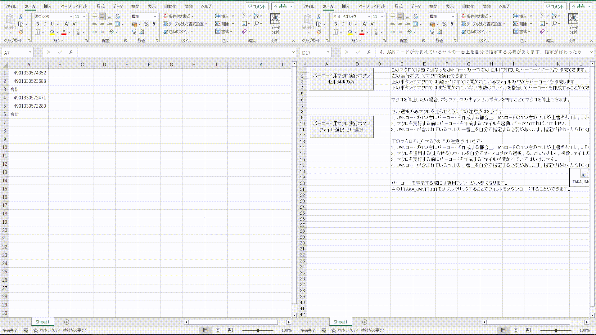

# コンテンツ
- [マクロ入りのexcelファイル](バーコードマクロ.xlsm) > マクロとマクロの説明、注意点やバーコードフォントを含めたエクセルファイル
- [マクロ](macro.bas) > excelに含まれているマクロ
- [バーコードフォント](TAKA_JANTT.ttf) > [個人ブログ](https://takachan.jra.net/computer/font.php)で公開されているフリーのバーコードフォント
# プレビュー

# 使い方
1. [マクロ入りのexcelファイル](バーコードマクロ.xlsm)をダウンロードする
2. [バーコードフォント](TAKA_JANTT.ttf)をダウンロード、インストールする
3. マクロ入りのexcelファイルのsheet1にあるマクロ実行ボタンを押し、マクロを実行する
4. JANコードが含まれている列の一番上のJANコードを選択する

# 説明
- 選択されたセルから下にある13桁若しくは8桁のJANコードに対応したバーコードを一つ右のセルに作成します
  (一つ右のセルに上書きで作成されるため、事前に空白の列を準備しておくことをお勧めします)
- 「JANバーコード作成_13桁8桁対応_セル選択のみ」のマクロではマクロ実行時に既にExcelで開かれているファイルからのみバーコードを作成できます
  (マクロ実行後にファイルを開くことはできません。事前に開いておく必要があります。)
- 「JANバーコード作成_13桁8桁対応_ファイル指定」のマクロではマクロ実行時に複数のファイルからバーコードを作成できます
- 「JANバーコード作成_13桁8桁対応_ファイル指定」ではマクロ実行後指定のファイルは保存され閉じられます
